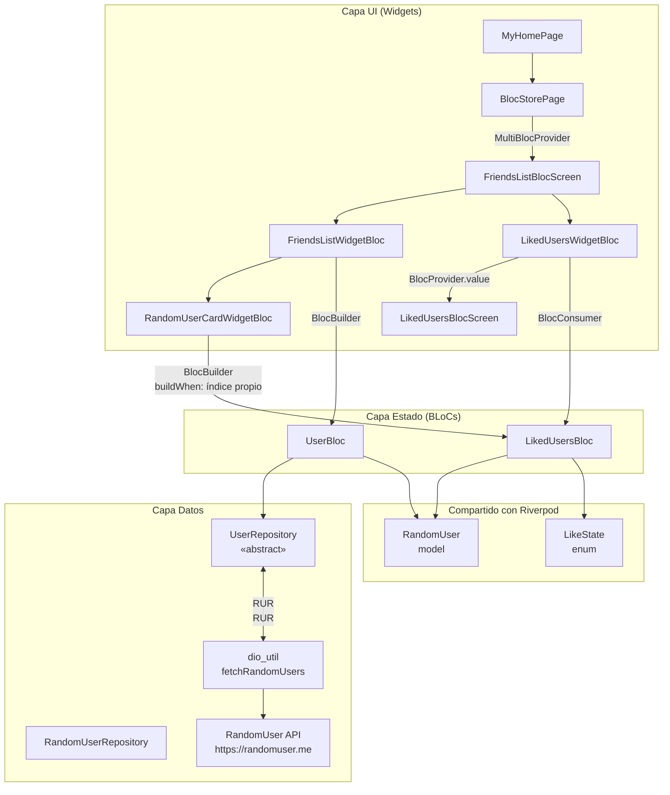
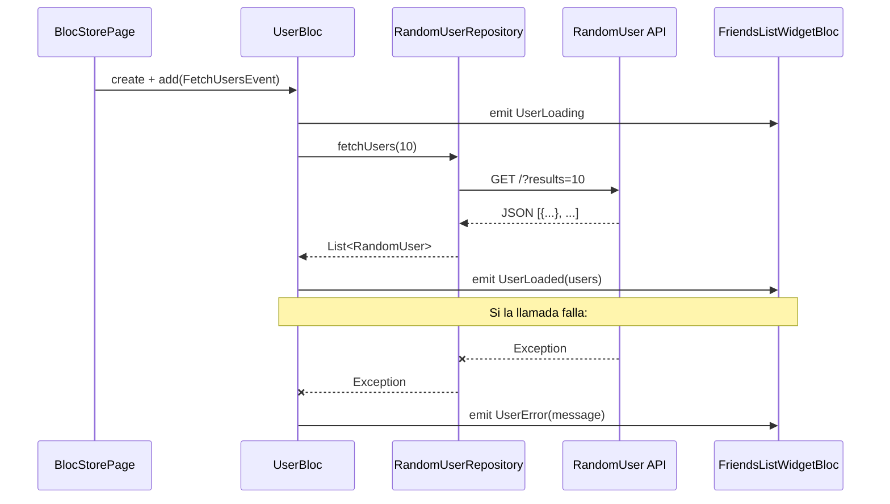
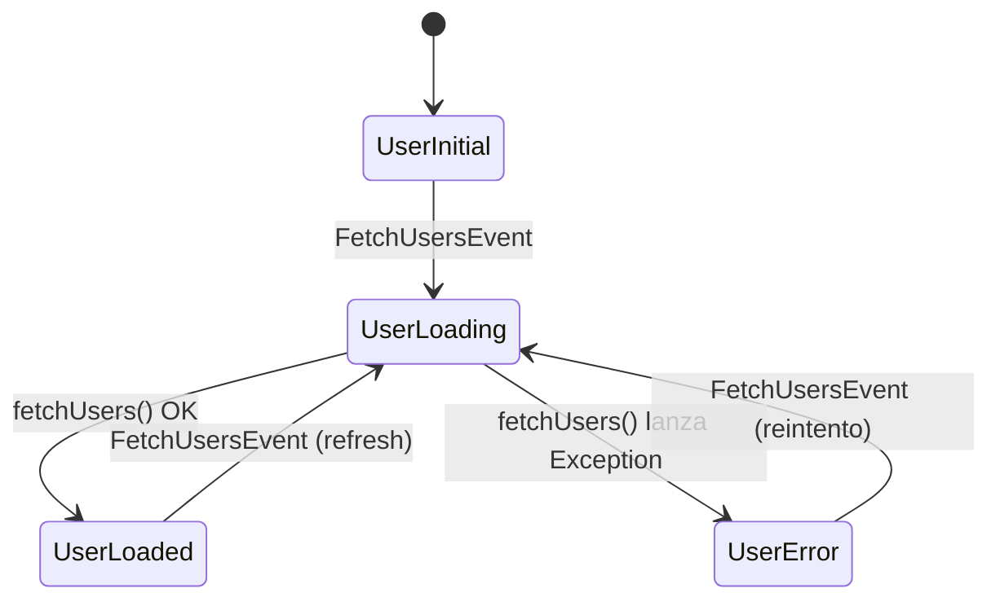
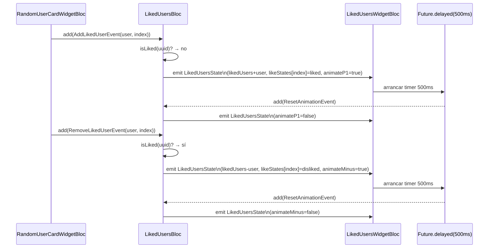
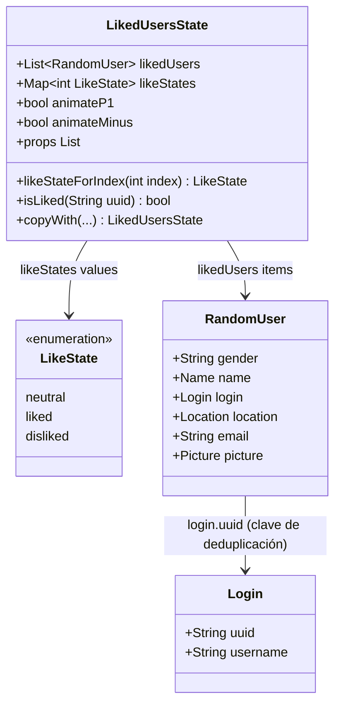
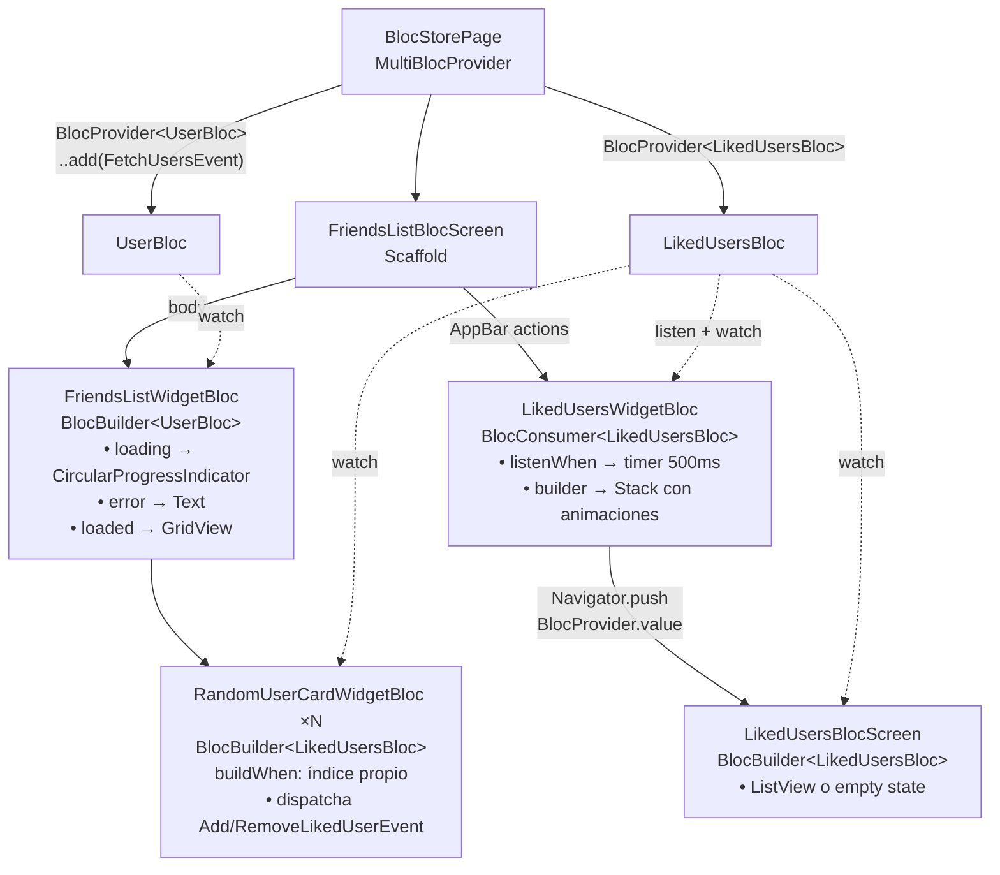
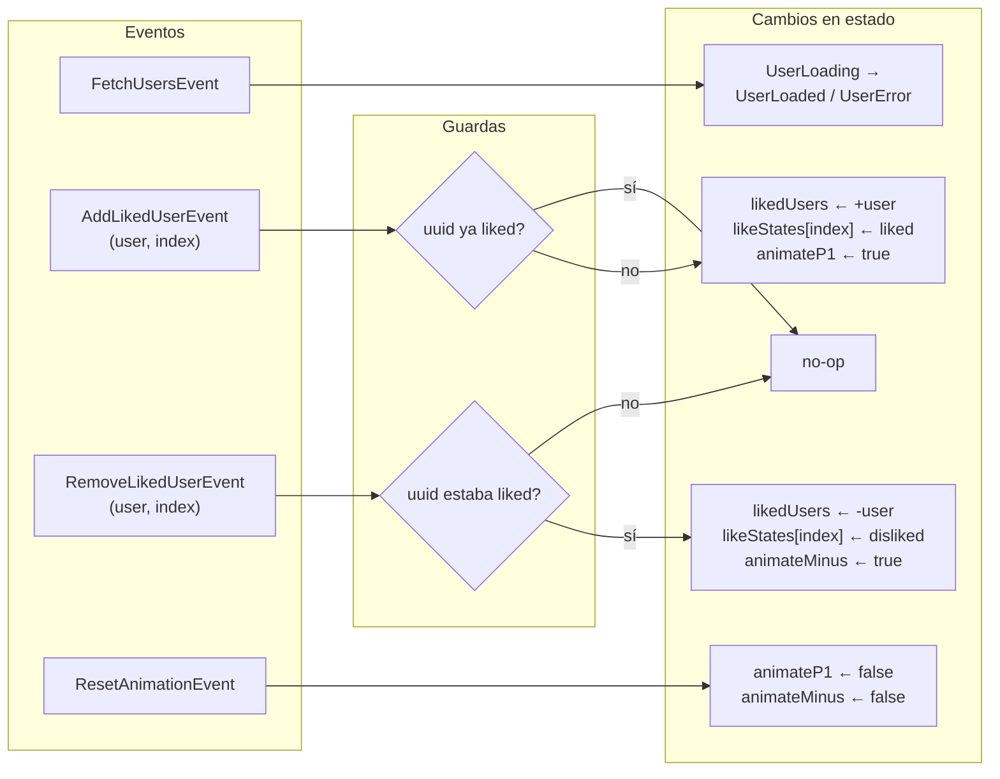

# Arquitectura BLoC — Store App

Diagramas de la implementación BLoC del proyecto. Cada diagrama cubre un nivel de abstracción distinto.

---

## 1. Visión general de capas

---

## 2. Ciclo de vida de UserBloc

---

## 3. Estados de UserBloc

---

## 4. Ciclo de vida de LikedUsersBloc

---

## 5. Estructura de LikedUsersState

---

## 6. Árbol de widgets BLoC

---

## 7. Eventos y sus efectos sobre el estado

