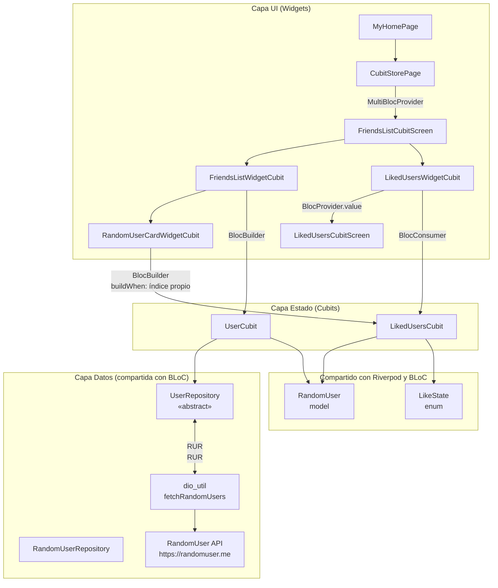
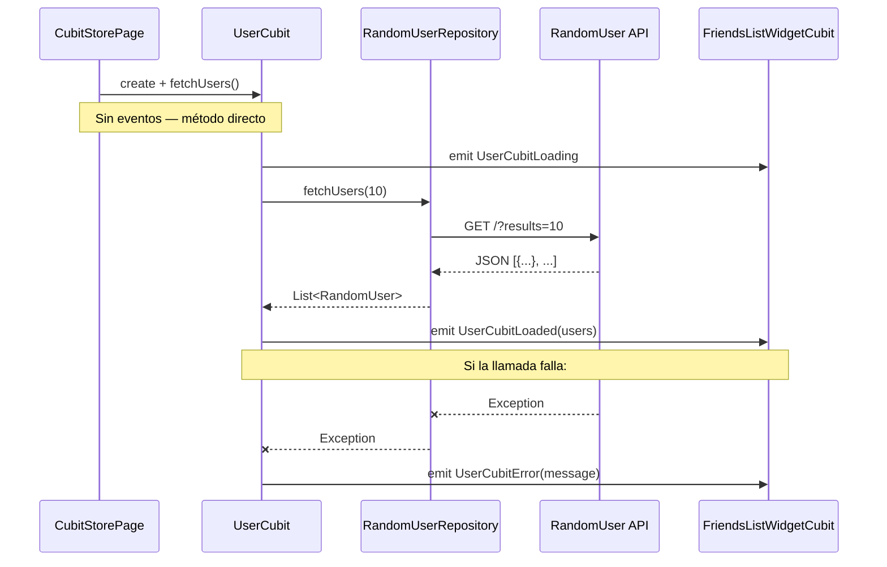
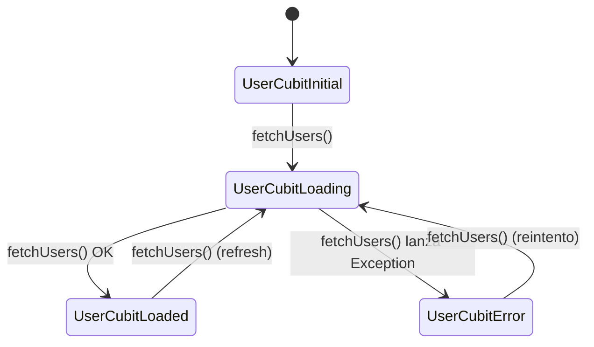
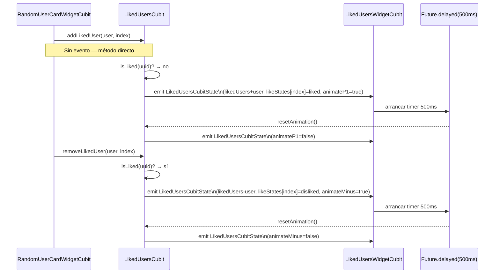
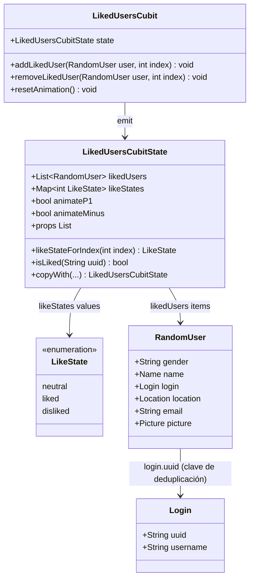
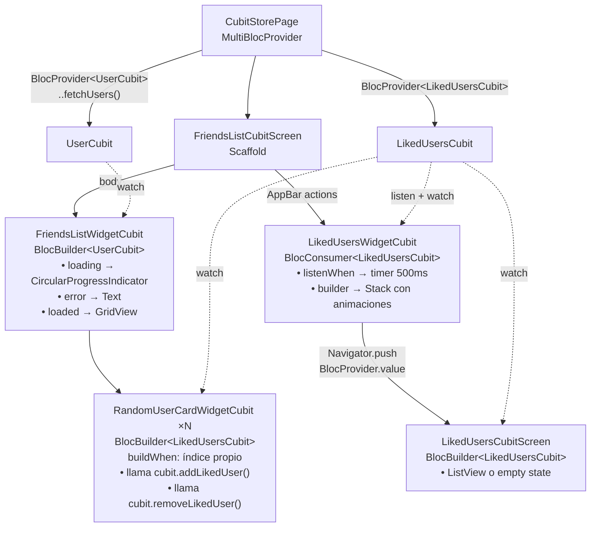
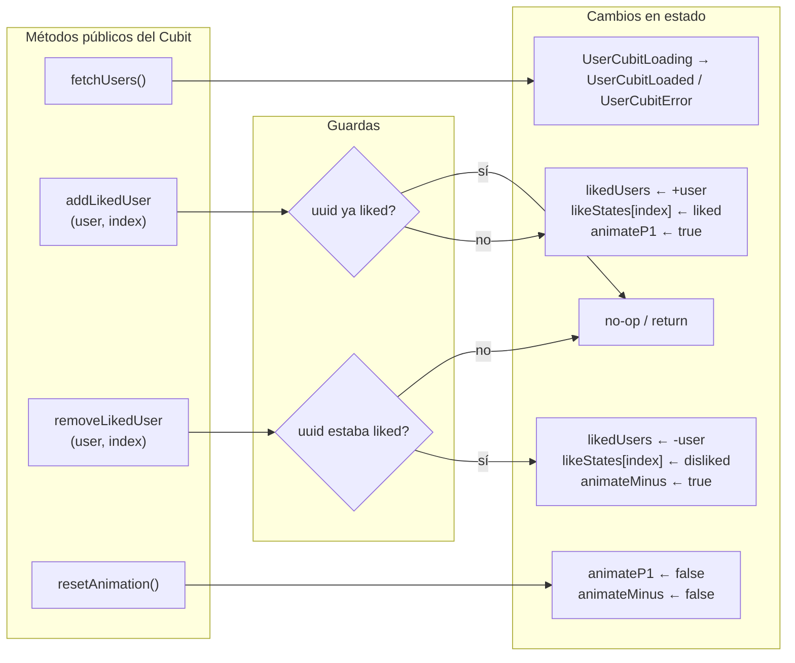

# Arquitectura Cubit — Store App

Diagramas de la implementación Cubit del proyecto. Cada diagrama cubre un nivel de abstracción distinto.

> **Cubit vs BLoC:** Cubit es una simplificación de BLoC. Elimina los eventos (clases `Event`) y expone métodos públicos que llaman `emit()` directamente. La API de widgets (`BlocBuilder`, `BlocConsumer`, `BlocProvider`) es idéntica porque `Cubit` extiende `BlocBase`.

---

## 1. Visión general de capas

---

## 2. Ciclo de vida de UserCubit

---

## 3. Estados de UserCubit

---

## 4. Ciclo de vida de LikedUsersCubit

---

## 5. Estructura de LikedUsersCubitState

---

## 6. Árbol de widgets Cubit

---

## 7. Métodos y sus efectos sobre el estado

---

## Comparativa BLoC vs Cubit en este proyecto

| Aspecto | BLoC | Cubit |
|---|---|---|
| Disparar acción | `bloc.add(FetchUsersEvent())` | `cubit.fetchUsers()` |
| Agregar like | `bloc.add(AddLikedUserEvent(...))` | `cubit.addLikedUser(user, index)` |
| Reset animación | `bloc.add(ResetAnimationEvent())` | `cubit.resetAnimation()` |
| Archivos por feature | 3 (event + state + bloc) | 2 (state + cubit) |
| Boilerplate | Mayor (clases Event) | Menor (métodos directos) |
| Trazabilidad | Alta (eventos logeables) | Media (métodos directos) |
| API de widgets | Idéntica | Idéntica |
